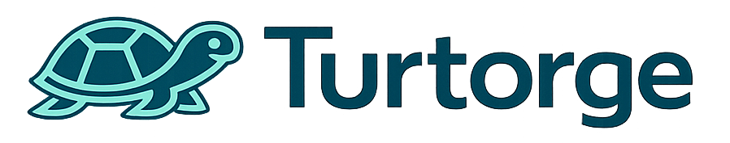

# Turtorge



Turtorge is a workspace-oriented terminal manager for Windows and Apple Silicon macOS. It keeps native shells, development commands, and AI CLI tools inside one application-owned layout instead of opening external terminal windows.

The repository contains the completed Windows MVP and its native macOS 12+ extension. Turtorge uses Windows ConPTY or Unix PTYs through Rust and renders them with xterm.js inside a Tauri desktop window.

## Highlights

### Workspaces and layouts

- Application-owned terminal tabs, panes, and recursive horizontal or vertical splits.
- Draggable split ratios and same-workspace tab reordering or cross-pane tab movement.
- Independently expandable workspace rows with saved terminals listed in pane/tab order.
- Pinned and recent workspaces, quick open, runtime activity indicators, and last-workspace restoration.
- Persistent xterm.js instances across terminal and workspace switches, preserving stateful TUI applications such as Claude Code and k9s.
- Protected final pane, confirmed non-empty pane deletion, and sibling-tree promotion after deletion.

### Shells and terminal lifecycle

- Automatic PowerShell discovery with the highest installed version selected by default on Windows.
- Dynamic WSL distribution discovery with Docker-managed distributions hidden.
- Per-distribution login-shell detection and native interactive `zsh -l -i` or `bash -l -i` startup.
- Native macOS login-shell discovery for zsh, bash, optional Homebrew fish, and custom executable paths.
- Windows, UNC, WSL-mounted, WSL-native, and macOS working-directory models with visible validation failures.
- Explicit startup, force restart, close, process-exit, resize, input, and output lifecycle management in Rust.
- Shell, Claude Code, Codex, and custom command profiles with per-terminal environment variables and auto-start settings.
- Shift+Enter terminal encoding for compatible foreground TUI applications.

### Terminal and workspace actions

| Surface | Primary actions |
| --- | --- |
| Terminal tab or sidebar terminal | Open externally, start or force restart, rename, edit, and delete |
| Workspace row | Create a terminal in that workspace and rename the workspace |
| Pane action area | Create a terminal, split right, split down, and delete the pane |
| Terminal tab strip | Reorder tabs, move tabs between panes, and use the mouse wheel for horizontal overflow |

Context menus support right-click, Shift+F10, the Menu key, arrow-key navigation, Enter, and Escape with focus restoration. Right-clicking an inactive workspace or terminal targets that item without silently switching the current selection. Double-clicking a terminal tab remains the quick-rename path.

### External launchers

- Global launcher default with per-terminal overrides.
- Built-in profiles for File Explorer or Finder, Visual Studio Code, Cursor, Antigravity, Zed, IntelliJ IDEA, Rider, WebStorm, PyCharm, and Unity.
- Availability detection without executing candidate applications.
- Cloneable custom profiles using a structured executable and argument-token model.
- Typed `{path}`, `{wslPath}`, `{distribution}`, and `{projectRoot}` placeholders.
- WSL-aware path conversion and exact Unity Editor version resolution.
- Detached launcher processes that are not counted or terminated as Turtorge terminal sessions.

### Safety, persistence, and appearance

- Terminal input, output, and scrollback are never persisted to disk.
- Runtime scrollback is bounded to 1 MiB per running terminal and held only in memory.
- Atomic JSON persistence for workspace definitions and settings.
- Visible shell and working-directory failures without silent fallback to another shell or arbitrary folder.
- Multi-line paste, running-terminal close, destructive pane, and application-quit confirmations.
- Windows custom title-bar controls, macOS native traffic lights, system/light/dark themes, and a responsive 900×600 minimum layout.
- macOS close-to-hide and Dock-reopen behavior, with confirmed Command+Q termination of managed terminals.
- Plaintext environment-variable storage with an explicit warning in the UI.

## Technology

- Tauri v2 and Rust 2024
- `portable-pty` 0.9 over Windows ConPTY and Unix PTYs
- React 19, TypeScript, Vite, and Zustand
- xterm.js 6 with fit and web-links addons
- Vitest plus Rust unit and opt-in native PTY integration tests

## Requirements

Supported native environments:

- Windows 10 or 11 with WebView2
- Rust stable with the MSVC toolchain and a Windows SDK
- WSL only when WSL terminal profiles are required
- Apple Silicon macOS 12 or newer
- macOS Command Line Tools or Xcode, with Xcode required for Developer ID notarization
- Node.js 22.16.0, pnpm 11.9.0, and Rust 1.97.1

The repository pins Node.js through [`.node-version`](.node-version), pnpm through `packageManager`, and Rust through [`rust-toolchain.toml`](rust-toolchain.toml). Intel/x86 macOS artifacts are intentionally outside the supported target. See [`docs/MACOS_HANDOFF.md`](docs/MACOS_HANDOFF.md) for the native implementation and delivery record.

## Development

Install the locked dependencies and start the native application:

```sh
pnpm install --frozen-lockfile
pnpm tauri:dev
```

For a frontend-only preview with a mock terminal stream:

```sh
pnpm dev
```

Use the Tauri development command when testing real PowerShell or WSL PTYs, native dialogs, launchers, window behavior, or application lifecycle.

## Build a standalone Windows release

Run [`build-latest.bat`](build-latest.bat) from File Explorer or a terminal:

```powershell
.\build-latest.bat
```

The script synchronizes the locked pnpm dependencies and builds the current source through the Tauri CLI with `--no-bundle`. Every invocation uses a unique Cargo target directory:

```text
artifacts/YYYY-MM-DD_HH-mm-ss_fff/release/turtorge.exe
```

The isolated directory prevents the build from replacing the standard release or any previous executable that may still be running. This produces a standalone executable, not an installer; installer packaging, signing, and auto-update remain deferred.

Do not use a bare `cargo build --release` for delivery. It does not apply the Tauri CLI production configuration and may produce an executable that still expects the Vite development server.

## Build an Apple Silicon macOS release

Run [`build-latest-macos.sh`](build-latest-macos.sh) on an Apple Silicon Mac:

```sh
./build-latest-macos.sh
```

Each invocation creates an isolated release directory with both artifacts:

```text
artifacts/YYYY-MM-DD_HH-MM-SS/release/bundle/macos/Turtorge.app
artifacts/YYYY-MM-DD_HH-MM-SS/release/bundle/dmg/Turtorge_0.2.0_aarch64.dmg
```

Without Apple credentials, the application receives an ad-hoc signature. To enable Developer ID signing, set `APPLE_SIGNING_IDENTITY`. To notarize, additionally provide either `APPLE_API_KEY`, `APPLE_API_ISSUER`, and `APPLE_API_KEY_PATH`; `APPLE_ID`, `APPLE_PASSWORD`, and `APPLE_TEAM_ID`; or an `APPLE_KEYCHAIN_PROFILE`. Credentials stay outside the repository.

## Verification

Run the default frontend and Rust checks:

```sh
pnpm test
pnpm build
cargo test --manifest-path apps/desktop/src-tauri/Cargo.toml
cargo clippy --manifest-path apps/desktop/src-tauri/Cargo.toml --all-targets -- -D warnings
```

The opt-in PTY test on Windows requires locally installed PowerShell and WSL shells:

```powershell
cargo test --manifest-path apps/desktop/src-tauri/Cargo.toml real_wsl_login_shells_round_trip_through_a_pty -- --ignored --nocapture
```

It exercises detected PowerShell, WSL bash, and WSL zsh profiles through real ConPTY sessions, including startup, input/output, working-directory behavior, and clean exit.

On macOS, run the native zsh/bash/fish PTY round trip:

```sh
cargo test --manifest-path apps/desktop/src-tauri/Cargo.toml real_native_login_shells_round_trip_through_a_pty -- --ignored --nocapture
```

The current verified frontend suite contains 47 tests. The macOS Rust suite contains 23 default tests plus 4 opt-in native PTY/process integration tests. Production builds emit a known non-blocking warning because the main JavaScript chunk exceeds 500 kB; code splitting remains a future optimization.

## Architecture

- [`apps/desktop/src/`](apps/desktop/src/) owns React presentation, layout interaction, xterm.js instances, and typed Tauri IPC calls.
- [`apps/desktop/src/components/terminals/`](apps/desktop/src/components/terminals/) owns pane/tab rendering, persistent terminal views, terminal actions, and terminal keyboard behavior.
- [`apps/desktop/src-tauri/src/terminal.rs`](apps/desktop/src-tauri/src/terminal.rs) owns PTYs, child processes, subscribers, lifecycle transitions, and in-memory scrollback.
- [`apps/desktop/src-tauri/src/platform.rs`](apps/desktop/src-tauri/src/platform.rs) isolates Windows, macOS, PowerShell, WSL, native shell, and path detection.
- [`apps/desktop/src-tauri/src/launcher.rs`](apps/desktop/src-tauri/src/launcher.rs) validates and launches external file managers, editors, IDEs, and Unity.
- [`apps/desktop/src-tauri/src/storage.rs`](apps/desktop/src-tauri/src/storage.rs) performs atomic workspace and settings persistence.
- [`apps/desktop/src/lib/layout.ts`](apps/desktop/src/lib/layout.ts) contains immutable split-tree and tab-layout operations.

Configuration and runtime are deliberately separate. Turtorge definitions persist to disk, while Rust owns live processes and React keeps terminal emulators mounted for routine switching. Quitting Turtorge terminates every managed process after confirmation; external launchers remain detached.

## Repository documentation

- [`docs/DEVELOPMENT_HISTORY.md`](docs/DEVELOPMENT_HISTORY.md) — authoritative decisions, discoveries, verification, delivery history, and deferred scope.
- [`docs/MVP_IMPLEMENTATION.md`](docs/MVP_IMPLEMENTATION.md) — confirmed MVP implementation decisions.
- [`docs/MACOS_HANDOFF.md`](docs/MACOS_HANDOFF.md) — native macOS implementation, verification, packaging, and credentialed-release guidance.
- [`docs/PRD.md`](docs/PRD.md) — original draft product requirements and vision; not an implementation inventory.
- [`docs/ARCHITECTURE.md`](docs/ARCHITECTURE.md) — original draft architecture and future boundaries; some proposed modules and dependencies were not adopted.
- [`docs/UI_SPEC.md`](docs/UI_SPEC.md) — original draft interaction and visual specification; it includes deferred surfaces.
- [`docs/ROADMAP.md`](docs/ROADMAP.md) — future product direction; completed state is governed by the development history.

## Current product boundary

The following remain intentionally deferred: Windows installer packaging and signing, macOS Developer ID credentials, auto-update, native Linux delivery, manifest import/export and repository trust, secure secret storage, diagnostic export, tags/groups, Git Bash, SSH, container and remote adapters, cross-workspace tab dragging, keyboard tab movement, and command-palette launcher access.

These are future phases rather than incomplete items in the approved Windows MVP. The non-negotiable boundaries remain: terminals stay embedded in Turtorge, the application owns tabs/panes/layouts, Rust owns PTYs and lifecycle, terminal content is not persisted, and shell or path failures remain visible.

## Design and branding

The UI follows the approved Superdesign explorations and the local tokens in [`.superdesign/design-system.md`](.superdesign/design-system.md). The original artwork remains at [`images/logo.png`](images/logo.png); generated application and platform icons are derived from it without modifying the source image.
